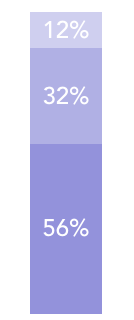

# PercentageStackBar

stack bar with percentage view for vue2.x

#### Installation

```js
npm i @litt1e-p/percentage-stack-bar
```

#### Usage

1. global registration
```js
// in main.js
import PercentageStackBar from '@litt1e-p/percentage-stack-bar'
import '@litt1e-p/percentage-stack-bar/dist/percentageStackBar.css'

Vue.use(PercentageStackBar)
```

2. use as vue component

```js
// in your vue file
import PercentageStackBar from '@litt1e-p/percentage-stack-bar'
import '@litt1e-p/percentage-stack-bar/dist/percentageStackBar.css'

export default {
  components: {
    PercentageStackBar
  }
  ...
}
```

#### Screenshots

